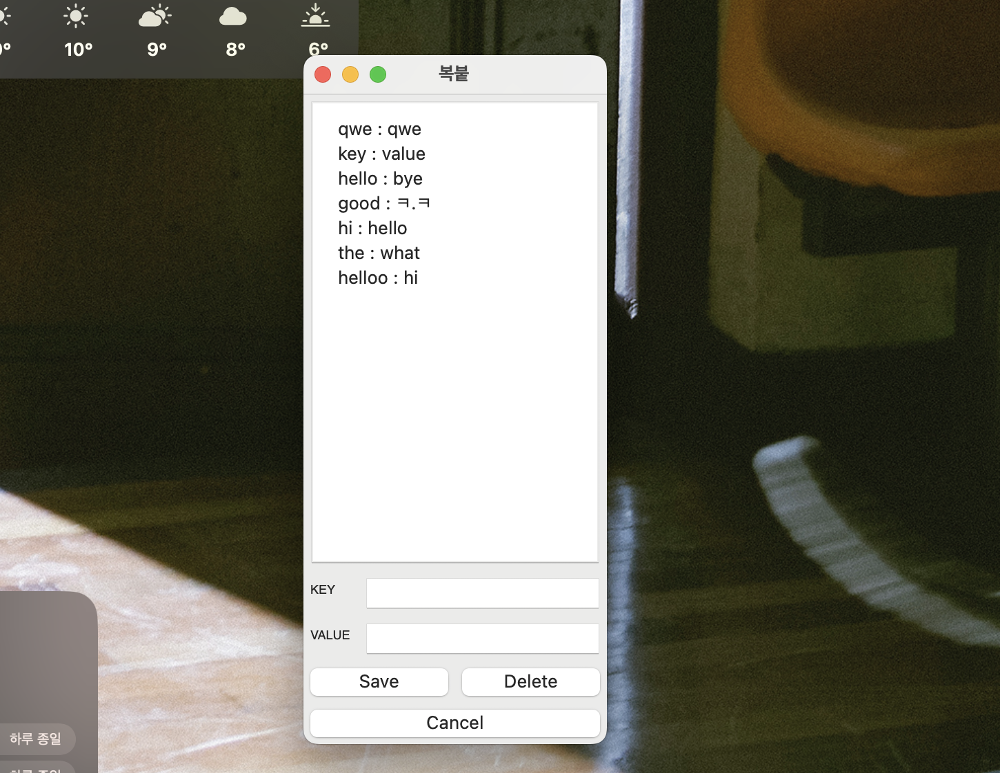

# 복붙 관리 애플리케이션

복붙이 너무 귀찮은 사람들을 위해 자주쓰는 값을 관리하고자 만든 애플리케이션입니다.



Material 디자인을 참고해 조금 더 깔끔한 스타일을 적용했습니다.

## 주요 기능

- **키-값 쌍 관리**: 자주 사용하는 텍스트를 키-값 쌍으로 저장
- **클립보드 복사**: 항목 클릭 시 자동으로 클립보드에 복사
- **다크/라이트 모드**: 시스템 테마에 따른 자동 색상 변경
- **데이터 영속성**: JSON 파일을 통한 데이터 저장
- **편집 기능**: 기존 항목 수정 및 삭제

## 프로젝트 구조

```
copyAndPaste/
├── main.py              # 메인 애플리케이션 진입점
├── constants.py         # 상수 정의
├── theme_manager.py     # 테마 관리 (다크/라이트 모드)
├── data_manager.py      # 데이터 관리 (JSON 파일 I/O)
├── ui_components.py     # 재사용 가능한 UI 컴포넌트
├── ui_manager.py        # 메인 UI 관리
├── README.md           # 프로젝트 문서
└── src/
    └── image.png       # 스크린샷
```

## 설치 및 실행

### 요구사항

- Python 3.7+
- wxPython

### 설치

```bash
pip install wxPython
```

### 실행

```bash
python main.py
```

## 사용법

1. **항목 추가**: "Add" 버튼을 클릭하여 새로운 키-값 쌍 추가
2. **복사**: 리스트에서 항목을 클릭하면 자동으로 클립보드에 복사
3. **편집**: 항목을 클릭한 후 입력 필드에서 수정
4. **삭제**: 항목을 선택한 후 "Delete" 버튼으로 삭제

## 기술적 개선사항

### 코드 구조 개선

- **모듈 분리**: 기능별로 파일을 분리하여 유지보수성 향상
- **타입 힌트**: Python 타입 힌트를 추가하여 코드 가독성 향상
- **상수 관리**: 매직 넘버를 상수로 분리하여 관리 용이성 향상

### 에러 처리 강화

- **예외 처리**: 각 모듈에서 적절한 예외 처리 추가
- **데이터 검증**: JSON 데이터 구조 검증 로직 추가
- **사용자 피드백**: 오류 발생 시 사용자에게 명확한 메시지 제공

### UI/UX 개선

- **테마 관리**: 시스템 테마 감지 및 자동 색상 적용
- **컴포넌트 분리**: 재사용 가능한 UI 컴포넌트로 분리
- **상태 표시**: 복사 완료 시 시각적 피드백 제공

## 라이선스

이 프로젝트는 개인 사용 목적으로 제작되었습니다.
