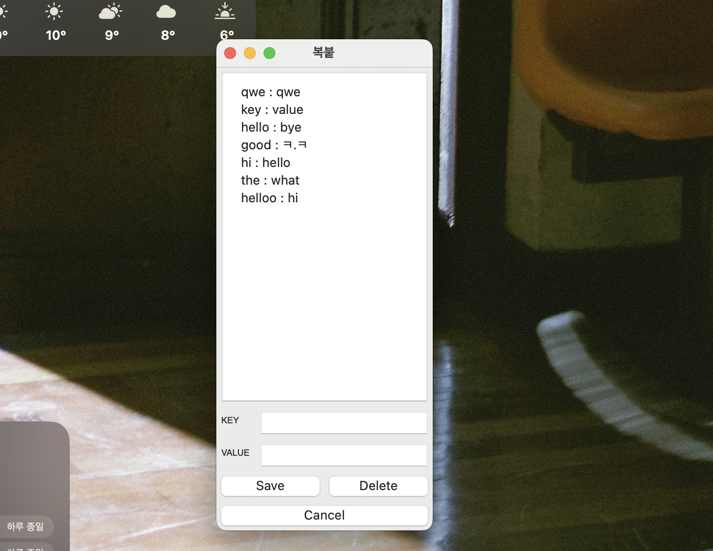

# 복붙 관리 애플리케이션

복붙이 너무 귀찮은 사람들을 위해 자주쓰는 값을 관리하고자 만든 애플리케이션입니다.



따뜻한 회색 유리 패널과 둥근 버튼으로 구성한 Windows 데스크톱 UI입니다. 위 이미지는 이전 버전 화면입니다.

## 주요 기능

- **키-값 쌍 관리**: 자주 사용하는 텍스트를 키-값 쌍으로 저장
- **클립보드 복사**: 항목 클릭 시 자동으로 클립보드에 복사
- **다크/라이트 모드**: 시스템 테마에 따른 자동 색상 변경
- **데이터 영속성**: JSON 파일을 통한 데이터 저장
- **편집 기능**: 기존 항목 수정 및 삭제

## 프로젝트 구조

```
copyAndPaste/
├── main.py              # 메인 애플리케이션 진입점
├── constants.py         # 상수 정의
├── theme_manager.py     # 테마 관리 (다크/라이트 모드)
├── data_manager.py      # 데이터 관리 (JSON 파일 I/O)
├── ui_components.py     # 재사용 가능한 UI 컴포넌트
├── ui_manager.py        # 메인 UI 관리
├── README.md           # 프로젝트 문서
└── src/
    └── image.png       # 스크린샷
```

## 설치 및 실행

### 요구사항

- Python 3.11+
- wxPython

### 설치

```bash
pip install -r requirements.txt
```

### 실행

```bash
python main.py
```

## 사용법

1. **항목 추가**: "Add" 버튼을 클릭하여 새로운 키-값 쌍 추가
2. **복사**: 리스트에서 항목을 클릭하면 자동으로 클립보드에 복사
3. **편집**: 항목을 클릭한 후 입력 필드에서 수정
4. **삭제**: 항목을 선택한 후 "Delete" 버튼으로 삭제

## 기술적 개선사항

### 코드 구조 개선

- **모듈 분리**: 기능별로 파일을 분리하여 유지보수성 향상
- **타입 힌트**: Python 타입 힌트를 추가하여 코드 가독성 향상
- **상수 관리**: 매직 넘버를 상수로 분리하여 관리 용이성 향상

### 에러 처리 강화

- **예외 처리**: 각 모듈에서 적절한 예외 처리 추가
- **데이터 검증**: JSON 데이터 구조 검증 로직 추가
- **사용자 피드백**: 오류 발생 시 사용자에게 명확한 메시지 제공

### UI/UX 개선

- **테마 관리**: 시스템 테마 감지 및 자동 색상 적용
- **컴포넌트 분리**: 재사용 가능한 UI 컴포넌트로 분리
- **상태 표시**: 복사 완료 시 시각적 피드백 제공

## 라이선스

이 프로젝트는 개인 사용 목적으로 제작되었습니다.

## 유리 스타일과 환경 설정

상단 톱니바퀴에서 테마(시스템/라이트/다크), 배경 블러(끄기/Mica/Acrylic),
패널 색상 농도(50–100)를 설정합니다. 확인을 누르면 바로 적용되고 재실행 후에도 유지됩니다.
취소는 변경을 버리고, 기본값 복원은 대화상자의 값만 초기화합니다.
설정은 Windows의 `%APPDATA%/CopyAndPaste/appearance.json`에 별도로 저장하여
기존 `data.json`의 항목과 글꼴 정보를 변경하지 않습니다.

- Windows 11 22H2(build 22621) 이상: 공식 DWM API의 Acrylic/Mica 배경 효과.
- Windows 10, 이전 Windows 11 및 다른 OS: 읽기 쉬운 불투명 스타일로 대체.
- 블러는 패널 사이의 창 배경에 적용됩니다. 목록과 입력 영역은 가독성을 위해 불투명하게 유지합니다.
- 블러 반경은 Windows가 관리합니다. 농도 슬라이더는 패널 색상을 조절하며 픽셀 단위 블러/창 전체 투명도가 아닙니다.
- Windows 투명 효과 설정, 고대비, 절전 및 원격 데스크톱 환경에 따라 실제 재질이 달라질 수 있습니다.
- 사용자 지정 제목 표시줄에서 이동, 최소화, 최대화/복원, 닫기가 가능합니다.
  제목 표시줄 더블 클릭은 최대화/복원하며, 창 테두리로 크기를 변경합니다.
- 항목 클릭 시 원문 복사, 추가/수정/삭제, Enter 저장 및 기존 JSON 저장 방식을 유지합니다.

[DWM 배경 재질 문서](https://learn.microsoft.com/windows/win32/api/dwmapi/ne-dwmapi-dwm_systembackdrop_type)

## 검증

```bash
python -m unittest discover -s tests -p "test_*.py"
python tests/windows_smoke.py
```

두 번째 명령은 wxPython과 데스크톱 세션이 필요하며 테스트 클립보드 값을 씁니다.
Windows CI에서 시작, 원문 복사, CRUD, 설정 대화상자, 크기 변경을 검사합니다.
실제 배경 효과는 Windows 11에서 라이트/다크, 블러 끄기/켜기, 최소화 후 복원,
배율 100%/150%/200%, 설정 저장 후 재실행을 직접 확인해야 합니다.
